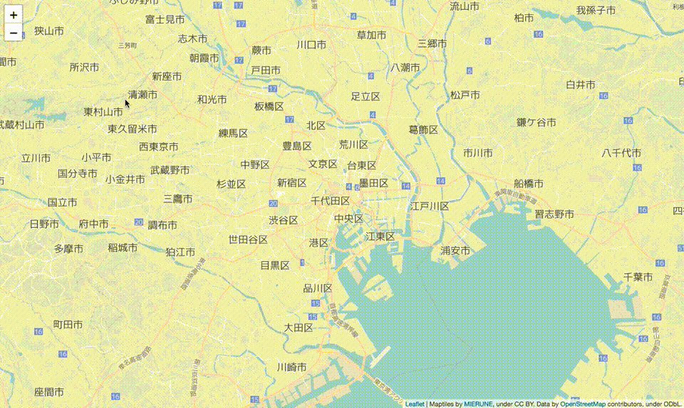
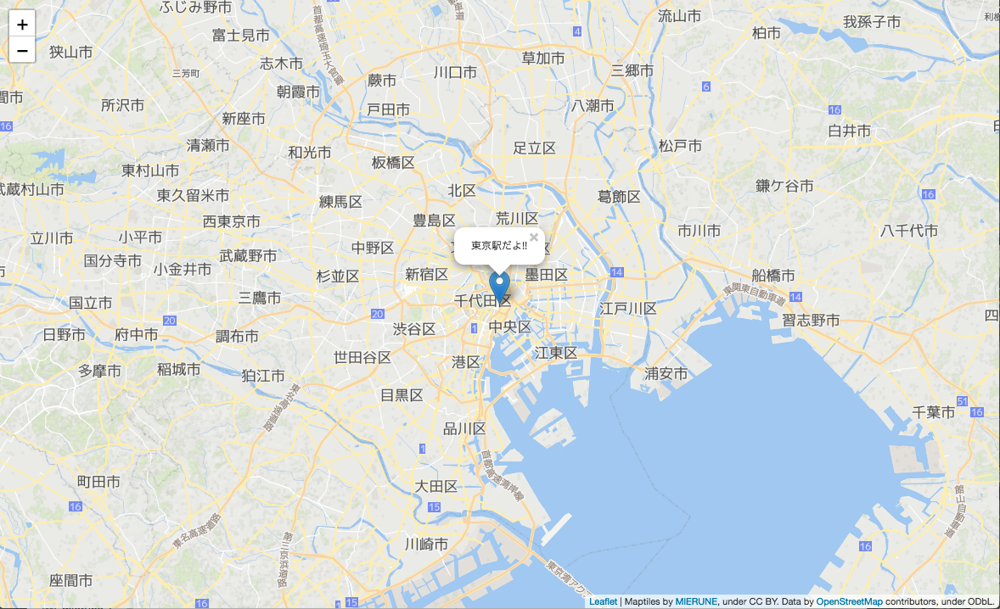

# MIERUNE地図 - Leaflet

<br>

## Getting Started

### MIERUNE地図表示 -「Free」プラン


example path
```
./src/001
```

index.html
```html
<!DOCTYPE html>
<html lang="ja">
    <head>
        <meta charset="UTF-8">
        <title>Leaflet example</title>

        <!--Leaflet 読み込み-->
        <script src="https://unpkg.com/leaflet@1.2.0/dist/leaflet.js"></script>
        <link href="https://unpkg.com/leaflet@1.2.0/dist/leaflet.css" rel="stylesheet"/>

        <link href="./css/stylesheet.css" rel="stylesheet"/>

    </head>
    <body>

        <div id="map"></div>

        <script src="./js/script.js"></script>

    </body>
</html>
```

stylesheet.css
```css
html, body {
    height: 100%;
    padding: 0;
    margin: 0;
}

#map {
    z-index: 0;
    height: 100%;
}
```

script.js
```javascript
// スタイル: mierune, mierune_mono
var style = "mierune_mono";

// URL設定
var url = "https://tile.mierune.co.jp/" + style + "/{z}/{x}/{y}.png";

// MIERUNE地図 読み込み
var m_map = new L.tileLayer(url, {
    attribution: "Maptiles by <a href='http://mierune.co.jp/' target='_blank'>MIERUNE</a>, under CC BY. Data by <a href='http://osm.org/copyright' target='_blank'>OpenStreetMap</a> contributors, under ODbL."
});

// 地図画面表示
var map = L.map('map', {
    center: [35.681, 139.767],
    zoom: 11,
    zoomControl: true,
    layers: [m_map]
});
```

<br>

---

<br>

### MIERUNE地図表示 -「Standard, Premium, Global Scale」プラン



example path
```
./src/002
```

index.html
```html
<!DOCTYPE html>
<html lang="ja">
    <head>
        <meta charset="UTF-8">
        <title>Leaflet example</title>

        <!--Leaflet 読み込み-->
        <script src="https://unpkg.com/leaflet@1.2.0/dist/leaflet.js"></script>
        <link href="https://unpkg.com/leaflet@1.2.0/dist/leaflet.css" rel="stylesheet"/>

        <link href="./css/stylesheet.css" rel="stylesheet"/>

    </head>
    <body>

        <div id="map"></div>

        <script src="./js/script.js"></script>

    </body>
</html>
```

stylesheet.css
```css
html, body {
    height: 100%;
    padding: 0;
    margin: 0;
}

#map {
    z-index: 0;
    height: 100%;
}
```

script.js
```javascript
// 「Standard, Premium, Global Scale」プラン 認証キー
var apikey = "xxxxxxxxxx";

// スタイル: normal, gray, bright, blue, warm, MIERUNE
var style = "normal";

// URL設定
var url = "https://tile.cdn.mierune.co.jp/styles/" + style + "/{z}/{x}/{y}.png" + "?key=" + apikey;

// MIERUNE地図 読み込み
var m_map = new L.tileLayer(url, {
    attribution: "Maptiles by <a href='http://mierune.co.jp/' target='_blank'>MIERUNE</a>, under CC BY. Data by <a href='http://osm.org/copyright' target='_blank'>OpenStreetMap</a> contributors, under ODbL."
});

// 地図画面表示
var map = L.map('map', {
    center: [35.681, 139.767],
    zoom: 11,
    zoomControl: true,
    layers: [m_map]
});
```

<br>

---

<br>

### マーカー・ポップアップ表示



example path
```
./src/003
```

script.js
```javascript
// マーカー設定
var Map_Point = L.marker(
    [35.681, 139.767]
).addTo(map);

// ポップアップ設定
var comment = '東京駅だよ!!';
Map_Point.bindPopup(comment).openPopup();
```

<br>

---

<br>

## Other information

- [Leaflet](http://leafletjs.com)  
- [Leaflet Tutorials](http://leafletjs.com/examples.html)  
- [Leaflet API reference](http://leafletjs.com/reference-1.2.0.html)  